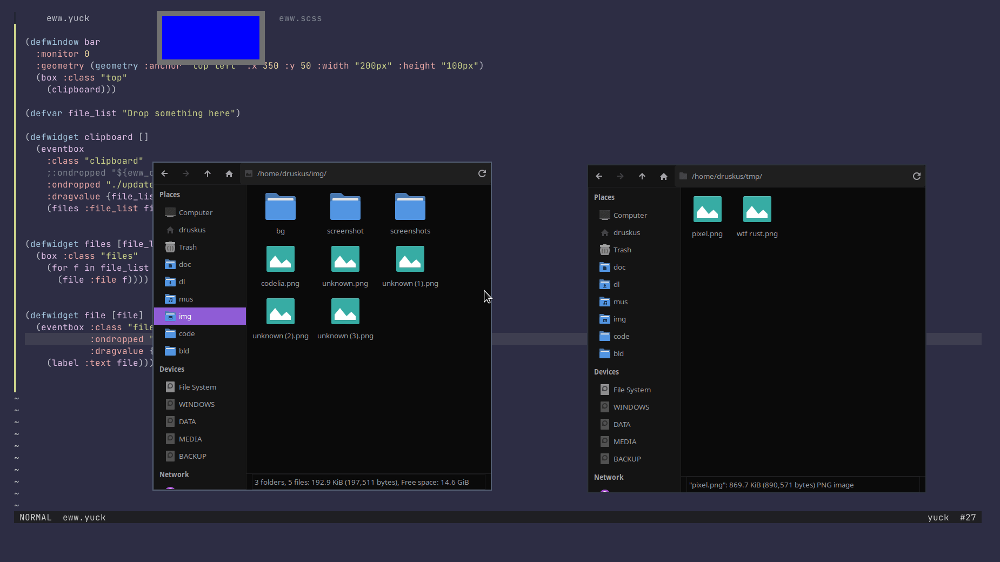

# eugh
The different [eww](https://github.com/elkowar/eww) configs that I've been making

    
     
    Polybar Replacement

    
     
    Workspace Indicator

    
     
    Drag and Drop Clipboard

    
     
    Revealer Example

    
     
    Notification Revealer

    
     
    Hover Switch

    
     
    Revealer Hover Module

    
     
    Collapsed Scales Concept

    
     
    Bar Concept

## See also 
[My dotfiles](https://github.com/druskus20/dots) (for the most uppdated version of my current eww config)
